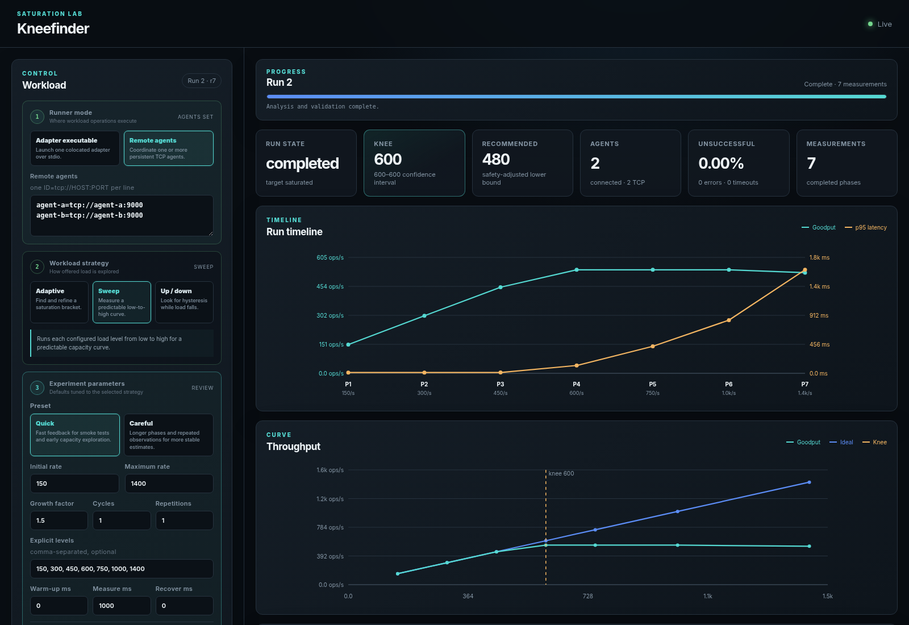
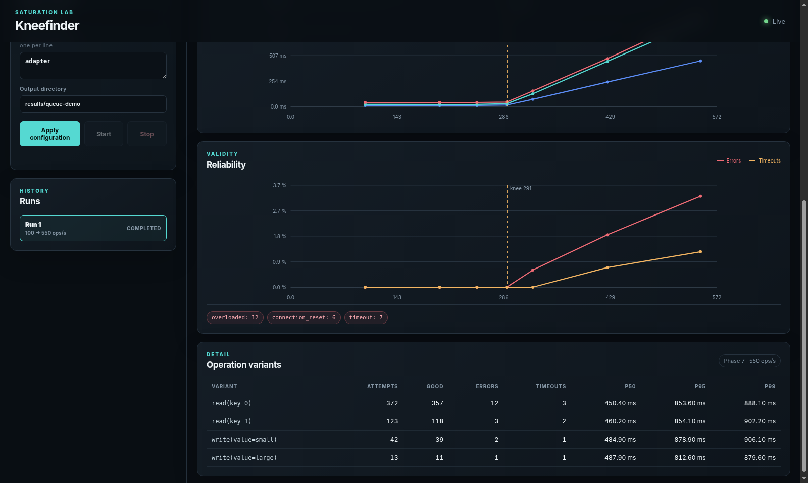

# Kneefinder

Kneefinder drives an arbitrary system at increasing offered load and finds the
point where throughput stops scaling normally and latency begins reflecting
queueing delay. That point is the **knee**.

The benchmark driver is generic. A small external adapter describes the
operations it supports and calls the native client for the system being tested.
The transport-independent adapter protocol is versioned newline-delimited JSON,
so an agent can be written in any language and reached through either a
supervised stdio process or a persistent TCP connection.



## What it measures

- offered load and successful goodput
- p50, p95, and p99 client and total latency
- load-generator dispatch lag
- failures, timeouts, unsuccessful rate, and failures grouped by stable error code
- overall results and independent series for every bound operation variant
- a knee estimate, confidence bounds, and a conservative operating rate

An operation plus its concrete arguments is one workload variant. For example,
`read(key=0)` and `read(key=1)` receive independent weights and independent
statistics.



The reliability view above uses fault-injected high-load phases to demonstrate
error-code grouping and explicit timeout reporting.

## Try the containerized multi-agent demo

The included demo combines an adapter with a four-worker FIFO service. Its
weighted service time gives it a theoretical knee near 291 requests per second.
The default demo runs the real distributed topology:

```text
browser -> web coordinator -> TCP agent A -> queue workers
                           \-> TCP agent B -> queue workers
```

Start all three containers with either Docker Compose:

```console
docker compose -f demo/queue-demo/compose.yaml up --build
```

or Podman Compose:

```console
podman-compose -f demo/queue-demo/compose.yaml up --build
```

Open <http://127.0.0.1:8080>. The coordinator waits for both agents, initiates
both TCP sessions, queries their operation catalogs, validates that their
schemas match, and exposes the discovered workload in the browser. It does not
start workload traffic automatically. Review or edit the prepared seven-level
plan, then press Start. The dashboard updates with throughput, latency,
reliability, per-variant results, and run progress based on completed phases.
Around the knee, goodput flattens while latency rises sharply. After that run,
edit the load levels, timings, strategy, operation variants, or remote-agent
list. The dashboard saves the form and checks agent connectivity automatically;
press Start when it reports ready. The browser exposes the actual traversal
strategy directly and explains it in place; CLI-oriented presets are not shown.
Stop ends the active run while leaving both agents available for the next one.

The agents only listen on the private Compose network; they never dial or
register with the coordinator. They remain available for subsequent runs
configured in the dashboard, even after a prior run disconnects its sessions.
The dashboard is published on loopback only. When finished, stop the foreground
process with `Ctrl+C` and remove the demo containers:

```console
docker compose -f demo/queue-demo/compose.yaml down
```

Use `podman-compose` in the command above if that is how the demo was started.

For a quick local smoke test without a container runtime, the colocated mode remains
available:

```console
cargo run --release --manifest-path demo/queue-demo/Cargo.toml -- e2e
```

The same queue also provides a release-mode adaptive traversal check:

```console
cargo run --release --manifest-path demo/queue-demo/Cargo.toml -- e2e-adaptive
```

## Browser UI and API

Build and serve the optional web frontend:

```console
cargo run --features web -- serve
```

Open <http://127.0.0.1:8080>. The server exposes:

| Endpoint | Purpose |
| --- | --- |
| `GET /api/v1/snapshot` | Current run state and retained phase results |
| `POST /api/v1/commands` | Submit a serialized engine command |
| `GET /api/v1/ws` | Full-duplex commands, acknowledgements, and streamed events |
| `GET /healthz` | Process and API-version health |

The WebSocket sends an initial snapshot, then lifecycle and phase events. Slow
clients receive an explicit resynchronization snapshot rather than silently
continuing with gaps. The server binds to loopback by default; remote binding
requires `--allow-remote` and should be placed behind authenticated TLS.

The browser first saves the configured colocated and TCP endpoints, then sends
`prepare_agents`. The coordinator opens every session, performs the normal
`initialize`/`ready` handshake, validates that the cohort shares one schema,
and retains those initialized sessions for the run. The resulting operation
catalog updates the browser dynamically. Its structured editor uses typed
integer and text inputs plus dropdowns for advertised enum choices, supports
multiple bound variants of one operation, and keeps operations that are not
safe defaults behind an explicit add action.

## Configure a workload

The same resolved configuration is shared by CLI, web, and future TUI
frontends. A 90/10 read/write mix with 3:1 argument ratios becomes four flat
weights:

```console
cargo run -- run \
  --operation 'read:key=0@27' \
  --operation 'read:key=1@9' \
  --operation 'write:value=small@3' \
  --operation 'write:value=large@1' \
  --print-config
```

Remove `--print-config` and put a colocated adapter command after `--` to
execute the resolved plan. The CLI prepares the adapter, streams one progress
line per measured phase, and prints the terminal run snapshot as JSON:

```console
cargo run -- run \
  --strategy sweep \
  --levels 100,200,400 \
  --measurement 10s \
  --latency-slo-ms 25 \
  --maximum-unsuccessful-rate 0.01 \
  --safety-factor 0.8 \
  --operation 'read:key=0@1' \
  -- ./adapter
```

A run may combine the colocated `-- ./adapter` mode with explicitly addressed
remote agents:

```console
cargo run -- run \
  --agent-endpoint client-a=tcp://10.0.0.10:9000 \
  --agent-endpoint client-b=tcp://10.0.0.11:9000 \
  --print-config \
  -- ./local-adapter
```

The coordinator always initiates these TCP sessions. Agents listen on the
configured endpoints and never dial or register with the coordinator.

Durations and load traversal are configurable without a YAML file:

```console
cargo run -- run \
  --preset careful \
  --strategy up-down \
  --levels 100,200,300,400 \
  --warmup 10s \
  --measurement 30s \
  --recovery 15s \
  --cycles 3 \
  --print-config
```

## Write an adapter

An agent implements one protocol regardless of transport. The zero-setup mode
uses a child process whose stdin and stdout carry one JSON message per line;
logs go to stderr. The remote mode listens for a coordinator-initiated TCP
connection and carries the same newline-delimited messages over that stream.
Its lifecycle is:

1. Receive `initialize` and reply with `ready`, including adapter identity,
   capabilities, and operation descriptors.
2. Receive batches of scheduled operations with absolute phase time and relative
   per-operation deadlines.
3. Call the target's native client and return measured operation results.
4. Echo the operation name and concrete arguments in every result.
5. Return stable, low-cardinality error codes and represent timeouts explicitly.

The complete stdio Rust example is [examples/rust-adapter.rs](examples/rust-adapter.rs),
and the queue demo provides both stdio and TCP implementations.
The only target-specific part is the function that calls the system under test:

```rust
fn call_target(
    operation: &str,
    arguments: &BTreeMap<String, ArgumentValue>,
) -> Result<(), &'static str> {
    match operation {
        "get" => my_client.get(integer_argument(arguments, "key")?)
            .map(|_| ())
            .map_err(|_| "get_failed"),
        "put" => my_client.put(
            integer_argument(arguments, "key")?,
            string_argument(arguments, "value")?,
        ).map_err(|_| "put_failed"),
        _ => Err("unknown_operation"),
    }
}
```

Compile the example adapter with:

```console
cargo build --no-default-features --example rust-adapter
```

The production direction is to provide reusable language runtimes that own the
protocol, deadline dispatch, batching, and measurement, leaving adapter authors
with only an async callback like `call_target`.

## Error reporting

Errors are never discarded from latency data or hidden inside throughput.
Every overall and per-variant summary contains:

- attempts, successes, failures, and timeouts
- counts grouped by the adapter's error code
- latency and dispatch-lag distributions

The Rust API and dashboard derive error, timeout, and combined unsuccessful
rates from those counts without losing the exact underlying totals.

This makes a broken client, invalid workload, overloaded generator, and
saturated target visibly different failure modes.

## Current status

The adapter protocol, supervised subprocess and persistent TCP transports,
coordinator-owned colocated and remote session agents, fixed multi-agent cohort,
workload model, measurement types, statistics, lifecycle engine, queue
demonstration, CLI configuration, HTTP/WebSocket control plane, and browser UI
are implemented. The engine and browser also implement coordinator-owned agent
preparation, retained initialized cohorts, discovery events, and a typed
workload editor. The queue demo exercises both the colocated path and a
two-agent TCP cohort, including a Docker/Podman Compose deployment with the web
coordinator in a third container and the preparation flow in its live
dashboard. That demo can execute repeated browser-configured runs and gracefully
stop an active run while retaining its agents. The production engine now turns
prepared cohorts and `RunConfig` values into bounded, deterministic scheduled
operation batches for CLI and browser runs, including warmup, measurement,
recovery, repetitions, sweep/up-down traversal, per-phase statistics, and
bounded interruptible stop. Adaptive runs now establish a stable baseline,
discover a healthy/saturated bracket geometrically, and refine it with
geometric midpoints. Fixed time buckets can reject non-stationary phases;
adaptive runs repeat them within the configured repetition budget. Every load
selection, acceptance, repetition, rejection, and recovery interval is emitted
through the shared engine API and retained in browser run results. Completed
runs fit a continuous two-segment goodput model, compare it with a single-line
null model, validate the candidate using latency, reliability, in-flight
growth, and dispatch lag, and estimate deterministic confidence bounds from
measurement buckets. Resolved configuration records optional latency/error
SLOs, the safety factor, bootstrap count, and seed. The terminal result retains
both model parameters, every validity signal, the SLO capacity, the knee
interval, and the conservative operating recommendation. Stop preserves
results already received, sends
`CancelPhase` to active agents, and force-closes an unresponsive session after
the cancellation deadline. Durable run artifacts remain roadmap work.

See [docs/design.md](docs/design.md) for the measurement and knee-finding design.
